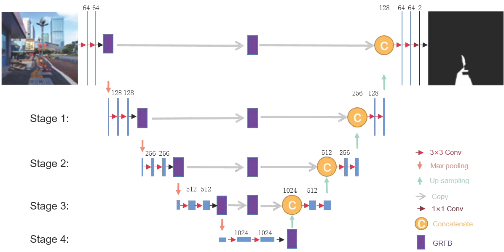
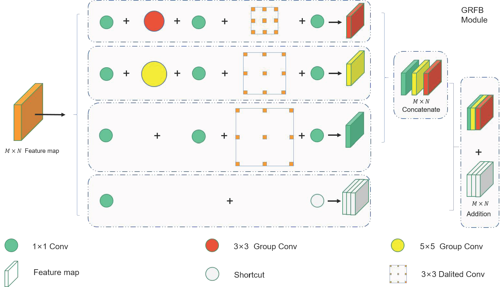

### GRFB-UNet: A new multiscale attention network with group receptive filed block for tactile paving segmentation
#### Xingli Zhang, Lei Liang, Shenglu Zhao, Zhihui Wang*
#### So far, this work has been accepted by Expert System with Applications
* Samples of annotated tactile paving on varied scenarios:


* Structure of the proposed GRFB-UNet network:


* Structure of the proposed GRFB module:


## Abstract
******
Tactile paving plays a crucial role in the travel of visually impaired people. Therefore, it is quite meaningful to identity the shape and location of tactile paving to support the mobility of the visually impaired, and visual segmentation technology is suitable of this task. To effectively improve the accuracy and robustness of tactile paving segmentation, a novel tactile paving segmentation method that combines UNet network and multi-scale feature extraction is proposed in this paper. It adds the structure of group receptive field block (GRFB) in the UNet network to obtain multi-scale receptive fields of the tactile paving. This method uses group convolution to reduce its calculation complexity. Meantime, small-scale convolution is used after each group convolution to achieve cross-channel information interaction and integration, aiming to extract more abundant high-level features. In this paper, we have constructed the dataset of tactile paving in various scenarios, and labeled for experimental evaluation. Furthermore, a comparative analysis with the typical networks and structure modules have been demonstrated in details. The experimental results show that the proposed network achieves the best performance among those compared networks on tactile paving segmentation, and provides a valuable reference for the detection of tactile paving.

## Experimental results
****

### Comparison of experimental prediction results of advanced network models:

| Method     | MIoU   | mPA     | Accuracy   | IoU    | Recall | Preision  |
|------------|--------|---------|------------|--------|--------|-----------|
| PSPNet     | 93.40  | 95.75   | 98.51      | 88.49  | 92.08  | 95.77     |
| SegNET     | 82.91  | 90.91   | 95.64      | 70.69  | 84.62  | 81.12     |
| FCN        | 72.79  | 78.21   | 93.51      | 52.57  | 57.84  | 85.21     |
| Simt       | 85.34  | 87.77   | 96.74      | 74.28  | 75.83  | 97.32     |
| DeepLabV3  | 92.60  | 95.23   | 98.32      | 87.09  | 91.11  | 95.18     |
| DeepLabV3+ | 91.53  | 94.85   | 98.85      | 85.26  | 90.59  | 93.55     |
| Mask R-CNN | 83.52  | 88.00   | 96.14      | 77.31  | 77.17  | 90.38     |
| GRFB-UNet  | 94.85  | 96.76   | 98.85      | 91.21  | 94.20  | 96.65     |

Notation: The results in the table are all percentage data (%).
## Installation
****
* Clone this repo, and we'll call the directory that you cloned as ${GRFBNet_ROOT}

* Install dependencies. CUDA, Python and PyTorch:

&ensp;1. [Install CUDA](https://developer.nvidia.com/cuda-downloads);

&ensp;2. Install anaconda, and create conda environment;

&ensp;3. [Install PyTorch 1.5.1 or later](https://pytorch.org/get-started/locally/);

&ensp;4. Install other dependencies.

A typical script of the environment installation (support in Linux; while the line 12-15 should be changed with corresponding orders in Windows) is given as follows:
```bash
bash demo.sh
```
Also, the environment can be installed with following orders instead:
```bash
conda create -n py python=3.7
conda activate py
conda install pytorch==1.5.1 torchvision==0.6.1 cudatoolkit=10.1 -c pytorch
pip install -r requirements.txt
```
or
```bash
conda create -n py python=3.7
conda activate py
conda install pytorch==1.5.1 torchvision==0.6.1 cudatoolkit=10.1 -c pytorch
conda install --yes --file requirements.txt
```

## Data preparation
***
**The TP-dataset can be downloaded from follows links:**

&ensp;1. [Baidu Net-disk](https://pan.baidu.com/s/1YgutfaiVE2KkqcKnWfGLSQ) (password: 9ope)

&ensp;2. [Google Drive](https://drive.google.com/drive/folders/1jByE5f_oUKpYdoR829wLqFSqlBYtOZM6?usp=sharing)

* After downloading, you should prepare the data in the following structure

```
TP-Dataset
   |——————JPEGImages
   |        └——————Part01
   |        └——————… …
   |——————GroundTruth
   |        └——————Part01
   |        └——————… …
   └——————SegmentationClassPNG
   |        └——————Part01
   |        └——————… …
   └——————Index
            └——————train.txt
            └——————val.txt
            └——————predict.txt
```
For each part in TP-Dataset, the images are stored in the file ./JPEGImages, and ground truths are stored in file ./ground truth. The masked images are stored in the file ./ SegmentationClassPNG and only used for visualization, which can be removed without any influence.
The indexes of train / validate / test samples are stored in flie ./Index.
Then, you can replace the file ./data/TP-dataset in ${GRFBNet_ROOT} with the downloaded dataset for training phase. 

Note that the images in this project are just some instances, they must be replaced by the aforemetioned dataset.

### Training

```console
> python train.py
usage: train.py [--data-path DP] [--num-classes NC] [--device D]
                [--batch-size BZ] [--epochs E] [--lr LR] [--momentum M]
		[--weight-decay WD][--print-freq PF][--resume R]
		[--start-epoch SE][--save-best SB][--amp A]

Train the UNet on images and ground truth (target masks)

optional arguments:
  '--data-path', default='./data/', help='dataset file path including ./TP-Dataset'
  '-num-classes', default=1, type=int
  '--device', default='cuda', help='training device'
  '-b', '--batch-size', default=8, type=int
  '--epochs', default=1800, type=int, metavar='N', help='number of total epochs to train'
  '--lr', default=0.02, type=float, help='initial learning rate'
  '--momentum', default=0.9, type=float, metavar='M', help='momentum'
  '--wd', '--weight-decay', default=1e-4, type=float, metavar='W', help='weight decay (default: 1e-4)', dest='weight_decay'
  '--print-freq', default=1, type=int, help='print frequency'
  '--resume', default='', help='resume from checkpoint'
  '--start-epoch', default=0, type=int, metavar='N', help='start epoch'
  '--save-best', default=True, type=bool, help='only save best dice weights'
  '--amp', default=False, type=bool, help='Use torch.cuda.amp for mixed precision training'
```
## Prediction
***
* After training phase, the models are saved in the file ./save_weights. At last, the testing images with the labels in predict.txt are predicted with

```console
python predict.py
usage: predict.py [--weights_path WP] [--img_path IP]
                [--txt_path TP] [--save_result SR]

optional arguments:
'--weights_path', default='./save_weights/model_best.pth', help='The root of TP-Dataset ground truth list file')
'--img_path', default='./data/TP-Dataset/JPEGImages', help='The path of testing sample images')
'--txt_path', default='./data/TP-Dataset/Index/predict.txt', help='The path of testing sample list')
'--save_result', default='./predict', help='The path of saved predicted results in images')
```

## Citation

```
@article{Zhang2023GrfbUNetAN,
  title={GRFB-UNet: A New Multiscale Attention Network with Group Receptive Field Block for Tactile Paving Segmentation},
  author={Xingli Zhang and Lei Liang and Sheng Zhao and Zhihui Wang},
  journal={SSRN Electronic Journal},
  year={2023},
  url={https://api.semanticscholar.org/CorpusID:256625405}
}
```
## Acknowledgement
Our GRFB-UNet is constructed based on the basic structure of [UNet](https://arxiv.org/abs/1505.04597). Thanks for their wonderful works.
```
@inproceedings{ronneberger2015u,
  title={U-net: Convolutional networks for biomedical image segmentation},
  author={Ronneberger, Olaf and Fischer, Philipp and Brox, Thomas},
  booktitle={Medical Image Computing and Computer-Assisted Intervention--MICCAI 2015: 18th International Conference, Munich, Germany, October 5-9, 2015, Proceedings, Part III 18},
  pages={234--241},
  year={2015},
  organization={Springer}
}
```
